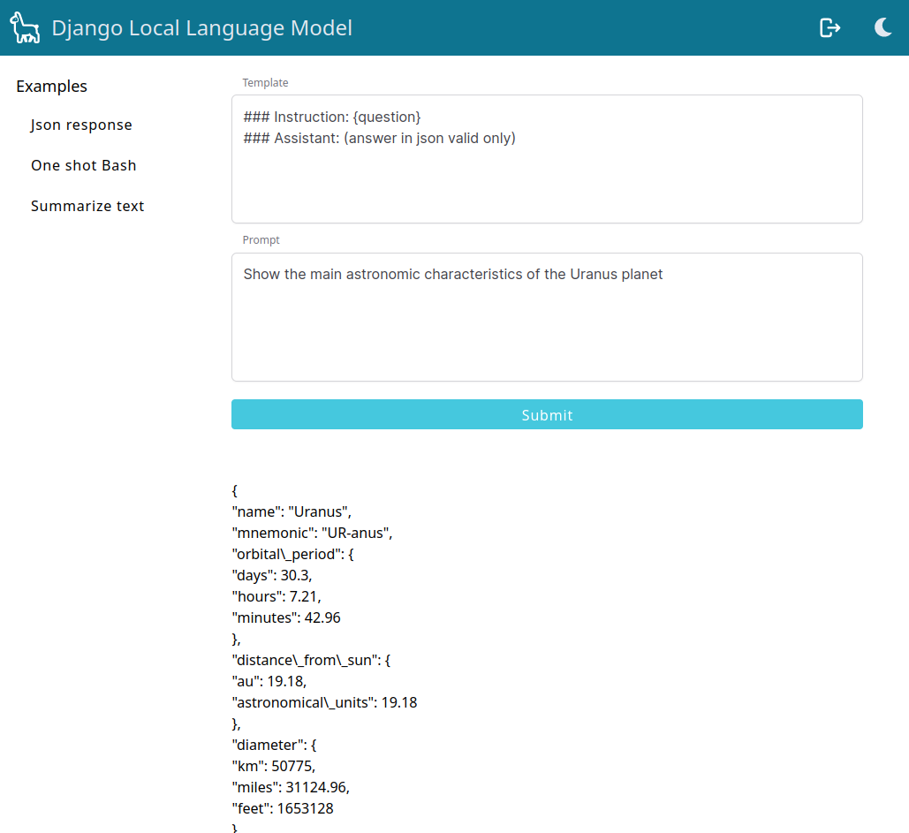

# Django local AI

Run a local AI from Django with [Llama.cpp](https://github.com/ggerganov/llama.cpp)

<div align="center">

</div>

## Install

Clone the repository and install the dependencies:

```bash
git clone https://github.com/emencia/django-local-ai
cd django-local-ai
make install
```

In case of an error *Failed to build llama-cpp-python* try this and run again:

```bash
source .venv/bin/activate
export SETUPTOOLS_USE_DISTUTILS=stdlib
pip install --upgrade --force-reinstall setuptools
```

Get the websockets server:

```bash
make installws
```

## Get a language model

To make this work you need a Llama.cpp ggml compatible language model. For example we
will use GPT4All-13B-snoozy from [this repository](https://huggingface.co/TheBloke/GPT4All-13B-snoozy-GGML):

```bash
cd some/dir/where/to/put/your/models
wget https://huggingface.co/TheBloke/GPT4All-13B-snoozy-GGML/resolve/main/GPT4All-13B-snoozy.ggmlv3.q5_0.bin
```

Change your settings accordingly by updating the `MODEL_PATH` setting in `main/settings.py`. Use an absolute path.

## Run

Run the http server:

```bash
make run
```

Run the task queue that will handle language model calls:

```bash
make lm
```

Run the websockets server:

```bash
make ws
```

Create a superuser:

```bash
make superuser
```

Open the frontend at `localhost:8000` and login
